# PlantUML examples

[PlantUML](http://plantuml.com) is a software tool that uses text formatting to create graphic diagrams. This page introduces PlantUML by showing examples with diagrams and source code, for UML, ERD, wireframes, mind maps, JSON, YAML, WBS, ASCII art, Gantt charts, C4 models, and more. 

## Sequence diagram

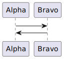

 
Diagram 1 plantuml

```plantuml
@startuml
skinparam monochrome true
Alpha -> Bravo
Bravo -> Alpha
@enduml
```

## Sequence diagram with steps and divider

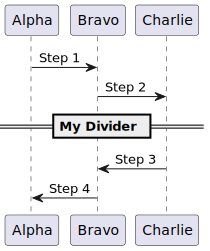

 
Diagram 2 plantuml

```plantuml
@startuml
skinparam monochrome true
Alpha -> Bravo: Step 1
Bravo -> Charlie: Step 2
== My Divider ==
Charlie -> Bravo: Step 3
Bravo -> Alpha: Step 4
@enduml
```

## Sequence diagram with participant shapes

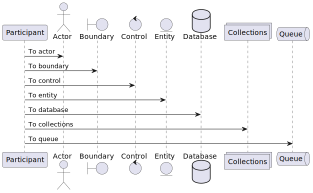

 
Diagram 3 plantuml

```plantuml
@startuml
skinparam monochrome true
participant Participant as Foo
actor       Actor       as Foo1
boundary    Boundary    as Foo2
control     Control     as Foo3
entity      Entity      as Foo4
database    Database    as Foo5
collections Collections as Foo6
queue       Queue       as Foo7
Foo -> Foo1 : To actor 
Foo -> Foo2 : To boundary
Foo -> Foo3 : To control
Foo -> Foo4 : To entity
Foo -> Foo5 : To database
Foo -> Foo6 : To collections
Foo -> Foo7: To queue
@enduml
```

## Usecase diagram

 
Diagram 4 plantuml

```plantuml
@startuml
skinparam monochrome true
left to right direction
User1 --> (Story1)
(Story1) --> (Story2)
(Story2) --> (Story3)
@enduml
```

## Object diagram

 
Diagram 5 plantuml

```plantuml
@startuml
skinparam monochrome true

object Object1 {
  Alpha
  Bravo
}

object Object2 {
  Charlie
  Delta
}

object Object3 {
  Echo
  Foxtrot
}

Object1 <|-- Object2
Object1 <|-- Object3
@enduml
```

## Class diagram

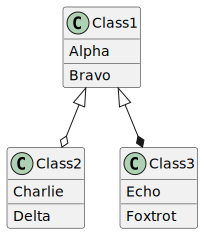

 
Diagram 6 plantuml

```plantuml
@startuml
skinparam monochrome true

' If you want to hide the "C" circle, then uncomment this line:
' hide circle

class Class1 {
  {field} Alpha
  {method} Bravo
}

class Class2 {
  {field} Charlie
  {method} Delta
}

class Class3 {
  {field} Echo
  {method} Foxtrot
}

Class1 <|--o Class2
Class1 <|--* Class3
@enduml
```

## Entity relationship diagram (ERD)

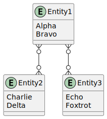

 
Diagram 7 plantuml

```plantuml
@startuml
skinparam monochrome true
skinparam linetype ortho

' If you want to hide the "E" circle, then uncomment this line:
' hide circle

entity Entity1 {
  Alpha
  Bravo
}

entity Entity2 {
  Charlie
  Delta
}

entity Entity3 {
  Echo
  Foxtrot
}

Entity1 }o-down-o{ Entity2
Entity1 }o-down-o{ Entity3
@enduml
```

## Package styles

 
Diagram 8 plantuml

```plantuml
@startuml
package "Demo Node" <<Node>> {
  object Object1
}
package "Demo Rectangle" <<Rectangle>> {
  object Object2
}
package "Demo Folder" <<Folder>> {
  object Object3
}
package "Demo Frame" <<Frame>> {
  object Object4
}
package "Demo Cloud" <<Cloud>> {
  object Object5
}
package "Demo Database" <<Database>> {
  object Object6
}
@enduml
```

## Activity diagram

 
Diagram 9 plantuml

```plantuml
@startuml
skinparam monochrome true
start
-> Starting;
:Activity 1;
if (Question) then (yes)
  :Option 1;
else (no)
  :Option 2;
endif
:Activity 2;
-> Stopping;
stop
@enduml
```

## Component diagram of items

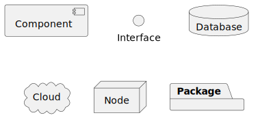

 
Diagram 10 plantuml

```plantuml
@startuml
skinparam monochrome true
component "Component"
interface "Interface"
database "Database"
cloud "Cloud"
node "Node"
package "Package"
@enduml
```

## State diagram

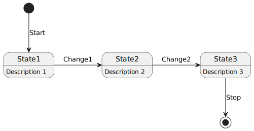

 
Diagram 11 plantuml

```plantuml
@startuml
skinparam monochrome true
[*] --> State1 : Start
State1 -> State2 : Change1
State2 -> State3 : Change2
State3 --> [*] : Stop
State1 : Description 1
State2 : Description 2
State3 : Description 3
@enduml
```

## Deployment diagram items

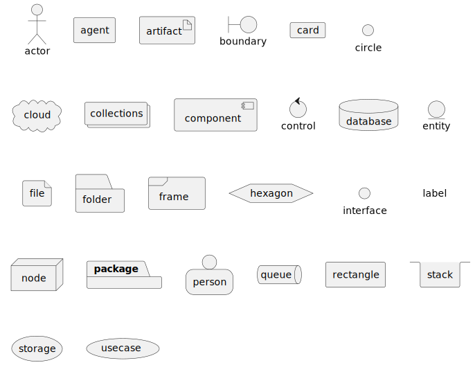

 
Diagram 12 plantuml

```plantuml
@startuml
skinparam monochrome true
actor actor
agent agent
artifact artifact
boundary boundary
card card
circle circle
cloud cloud
collections collections
component component
control control
database database
entity entity
file file
folder folder
frame frame
hexagon hexagon
interface interface
label label
node node
package package
person person
queue queue
rectangle rectangle
stack stack
storage storage
usecase usecase
@enduml
```

## Timing diagram

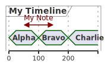

 
Diagram 13 plantuml

```plantuml
@startuml
skinparam monochrome true
concise "My Timeline" as T
@T
0 is Alpha
+100 is Bravo
+100 is Charlie
@50 <-> @+100 : My Note
@enduml
```

## Diagrams through ASCII art (DITAA)

View Source

<pre>
@startditaa
+--------+   +-------+    +-------+
|        +---+ ditaa +--> |       |
|  Text  |   +-------+    |diagram|
|Document|   |!magic!|    |       |
|     {d}|   |       |    |       |
+---+----+   +-------+    +-------+
    :                         ^
    |       Lots of work      |
    +-------------------------+
@endditaa
</pre>

## Wireframe

 
Diagram 14 plantuml

```plantuml
@startuml
salt
{
  Hello world
  [Button]
  ()  Radio 1
  (X) Radio 2
  []  Checkbox 1
  [X] Checkbox 2
  "Enter text here   "
  ^This is a droplist^
}
@enduml
```

## Gantt chart

View Source

<pre>
@startgantt
skinparam monochrome true
[Task1] on {Alice} lasts 8 days
then [Task2] on {Bob} lasts 4 days at 50%
then [Task3] on {Carol} lasts 2 days at 25%
@endgantt
</pre>

## Mind map

View Source

<pre>
@startmindmap
+ C
++ D
++ E
-- A
-- B
@endmindmap
</pre>

## JSON data

View Source

<pre>
@startjson
{
   "fruit":"Apple",
   "size":"Large",
   "color": ["Red", "Green"]
}
@endjson
</pre>

## YAML data

View Source

<pre>
@startyaml
fruit: Apple
size: Large
color: 
  - Red
  - Green
@endyaml
</pre>

## Network diagram

 
Diagram 15 plantuml

```plantuml
@startuml
nwdiag {
  network dmz {
      address = "210.x.x.x/24"

      web01 [address = "210.x.x.1"];
      web02 [address = "210.x.x.2"];
  }
}
@enduml
```

## Work breakdown structure (WBS)

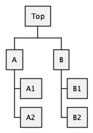

View Source

<pre>
@startwbs
* Top
** A
*** A1
*** A2
** B
*** B1
*** B2
@endwbs
</pre>

## OpenIconic

 
Diagram 16 plantuml

```plantuml
@startuml
title: <&heart> Demo <&heart>
@enduml
```

</pre>

OpenIconic provides open source icons. OpenIconic is now built-in to PlantUML.

## Font Awesome

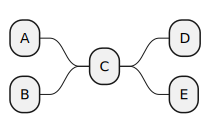

 
Diagram 17 plantuml

```plantuml
@startuml
skinparam monochrome true
!include &lt;font-awesome/star&gt;
rectangle "<$star>"
@enduml
```

## Procedure

 
Diagram 18 plantuml

```plantuml
@startuml
!procedure $demo($name, $headline, $description)
  card $name as "\n<size:22>$headline</size>\n\n<size:12>$description</size>\n"
!endprocedure

$demo(MyCard, "Hello World", "This is a demonstration")
@enduml
```

## Procedure layout

 
Diagram 19 plantuml

```plantuml
@startuml
skinparam monochrome true
skinparam defaultTextAlignment center

!procedure $layout($shape, $name, $openiconic, $headline, $description)
  $shape $name as "\n\n<size:44><&$openiconic></size>\n<size:22><U+00A0><U+00A0>$headline<U+00A0><U+00A0></size>\n\n<U+00A0><U+00A0>$description<U+00A0><U+00A0>\n\n"
!endprocedure

$layout(card, MyCard, heart, "Hello World", "This is a demonstration")
@enduml
```

This shows how to create your own procedure to create a custom layout with a shape, object name, OpenIconic icon, headline that uses big size text, and a description that uses normal size text.

## Area diagram

The area diagram is an example deployment diagram that shows a bunch of areas and how they interrlate. This example is useful for seeing a real-world diagram, that uses boxes, arrows, Font Awesome icons, multi-line text, Unicode padding, font sizes, and more.

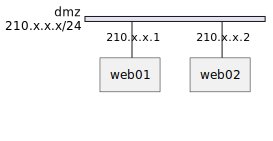

 
Diagram 20 plantuml

```plantuml
@startuml
skinparam monochrome true
skinparam defaultTextAlignment center

' icons
!include <font-awesome/check_circle>
!include <font-awesome/cloud>
!include <font-awesome/cubes>
!include <font-awesome/exchange>
!include <font-awesome/file_code_o>
!include <font-awesome/file_image_o>
!include <font-awesome/gavel>
!include <font-awesome/gear>
!include <font-awesome/globe>
!include <font-awesome/heart>
!include <font-awesome/share_alt_square>

' Pipeline objects
stack ""<size:20>Example</size>\n\nexample\nexample\nexample"" as StackLeft
card "<$cubes>\n<size:22><U+00A0><U+00A0>Example<U+00A0><U+00A0></size>\n\n<U+00A0><U+00A0>example, example, example <U+00A0><U+00A0>\n\n" as Pipeline1
queue "<$check_circle>\n<size:22><U+00A0><U+00A0>Example<U+00A0><U+00A0></size>\n\n<U+00A0><U+00A0>example, example, example<U+00A0><U+00A0>\n\n" as Pipeline2
card "<$cloud>\n<size:22><U+00A0><U+00A0>Example<U+00A0><U+00A0></size>\n\n<U+00A0><U+00A0>example, example, example<U+00A0><U+00A0>\n\n" as Pipeline3
stack "<size:20>Example</size>\n\nexample\nexample\nexample" as StackRight

' Pipeline flow
StackLeft -r-> Pipeline1 : "Example"
Pipeline1 -r-> Pipeline2 : "Example"
Pipeline2 -r-> Pipeline3 : "Example"
Pipeline3 -r-> StackRight : "Example"

' Left side
interface "Example" as InterfaceLeft
InterfaceLeft -u-> StackLeft

' Right side
interface "Example" as InterfaceRight
InterfaceRight -u-> StackRight

' Actor 1
actor "Actor 1" as Actor1
usecase "\n<$file_image_o>\n<size:20><U+00A0><U+00A0>Example<U+00A0><U+00A0></size>\n\nexample\nexample\nexample\n\n" as UseCase1
Actor1 -d-> UseCase1
UseCase1 -d-> Pipeline1

' Actor 2
actor "Actor 2" as Actor2
usecase "\n<$file_code_o>\n<size:20><U+00A0><U+00A0>Example<U+00A0><U+00A0></size>\n\nexample\nexample\nexample\n\n" as UseCase2
Actor2 -d-> UseCase2
UseCase2 -d-> Pipeline1

' Actor 3
actor "Actor 3" as Actor3
usecase "\n<$exchange>\n<size:20>Example</size>\n\nexample\nexample\nexample\n\n" as UseCase3
Actor3 -d-> UseCase3
UseCase3 -d-> Pipeline3

' Actor 4
actor "Actor 4" as Actor4
usecase "\n<$share_alt_square>\n<size:20>Example</size>\n\nexample\nexample\nexample\n\n" as UseCase4
Actor4 -d-> UseCase4
UseCase4 -d-> Pipeline3

' Diamond upper area
cloud "\n<$heart>\n<size:20>Example</size>\n\nexample, example, example\n\n" as DiamondUpper
DiamondUpper -d-> Pipeline1
DiamondUpper -d-> Pipeline2
DiamondUpper -d-> Pipeline3

' Diamond lower area
database "\n<$gear>\n<size:20>Example</size>\n\nexample, example, example\n\n" as DiamondLower
DiamondLower -u-> Pipeline1
DiamondLower -u-> Pipeline2
DiamondLower -u-> Pipeline3

' Hinting
UseCase1 -[hidden]r- UseCase2
UseCase2 -[hidden]r- DiamondUpper
DiamondUpper -[hidden]r- UseCase3
UseCase3 -[hidden]r- UseCase4

' Pipeline 1 controls
control "<size:20>Example</size>\n\nexample\nexample\nexample" as Pipeline1Control1 
control "<size:20>Example</size>\n\nexample\nexample\nexample" as Pipeline1Control2
Pipeline1Control1 -u-> Pipeline1
Pipeline1Control2 -u-> Pipeline1

' Pipeline 3 controls
control "<size:20>Example</size>\n\nexample\nexample\nexample" as Pipeline3Control1
control "<size:20>Example</size>\n\nexample\nexample\nexample" as Pipeline3Control2
Pipeline3Control1 -u-> Pipeline3
Pipeline3Control2 -u-> Pipeline3
@enduml
```

## C4 model

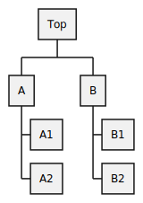

 
Diagram 21 plantuml

```plantuml
@startuml
!include <C4/C4_Container>

Person(personAlias, "Label", "Optional Description")
Container(containerAlias, "Label", "Technology", "Optional Description")
System(systemAlias, "Label", "Optional Description")

System_Ext(extSystemAlias, "Label", "Optional Description")

Rel(personAlias, containerAlias, "Label", "Optional Technology")

Rel_U(systemAlias, extSystemAlias, "Label", "Optional Technology")
@enduml
```

[C4 Model](https://c4model.com/) focuses diagrams on four areas: Context, Containers, Components, Code.

## Standard library

 
Diagram 22 plantuml

```plantuml
@startuml
stdlib
@enduml
```

You can list standard library folders by using the special diagram "stdlib".

## OpenIconic list

 
Diagram 23 plantuml

```plantuml
@startuml
listopeniconic
@enduml
```

You can list all the OpenIconic icon names and images by using the special diagram "listopeniconic".
